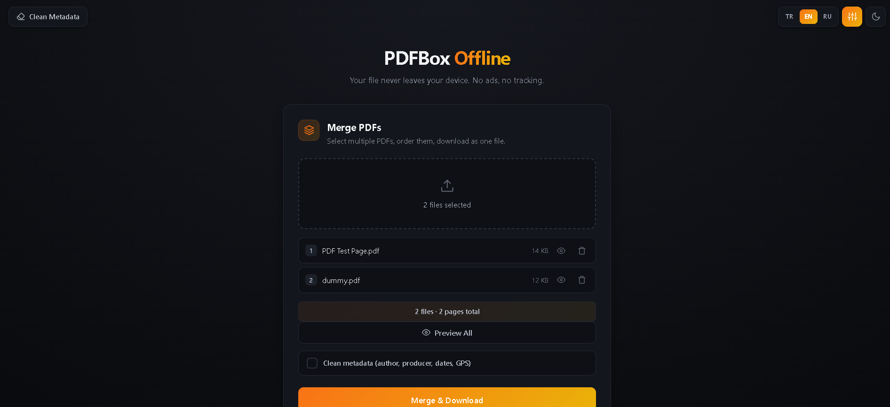
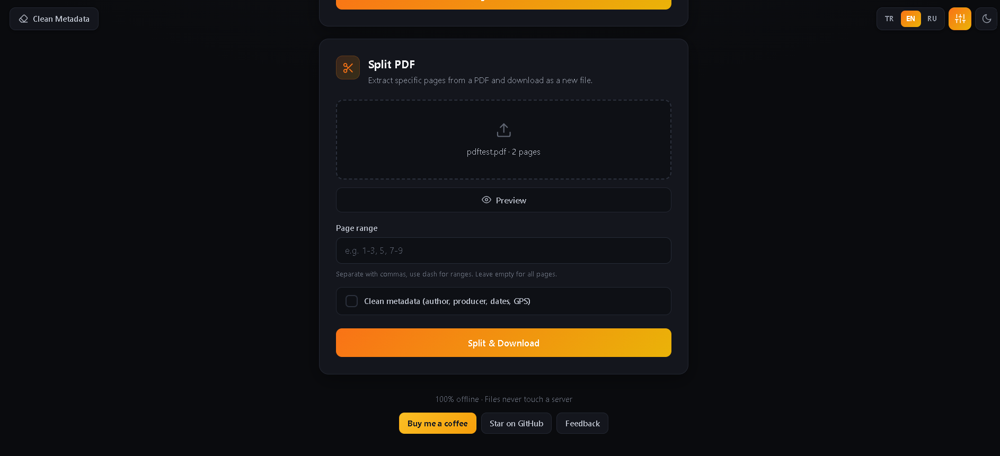
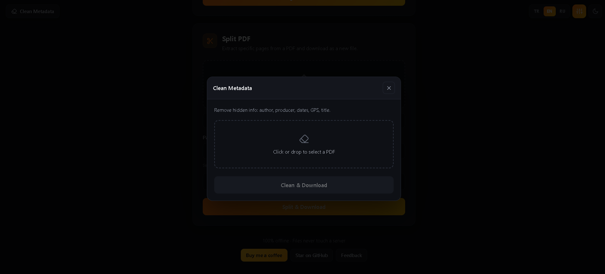

# 📦 PDFBox Offline

> Offline PDF toolbox — merge, split, preview, clean metadata. No upload. No ads. No tracking.

[](https://ahmetiinhoyo.github.io/Pdfbox-offline/)
[](https://www.buymeacoffee.com/Thorix)
[](https://github.com/ahmetiinhoyo/Pdfbox-offline)

**Languages:** 🇬🇧 English · [🇹🇷 Türkçe](README.tr.md) · [🇷🇺 Русский](README.ru.md)

---

## 📸 Screenshots

| 📎 Merge PDFs | ✂️ Split PDF | 🧹 Clean Metadata |
|:---:|:---:|:---:|
|  |  |  |

---

## ✨ Features

| Feature | Status |
|---|---|
| 📎 Merge PDFs | ✅ Ready |
| ✂️ Split PDF | ✅ Ready |
| 🖼️ Images to PDF (JPG/PNG/WEBP/GIF/BMP/AVIF) | ✅ Ready |
| 🖼️ Preview All (multi-file gallery) | ✅ Ready |
| 🔍 Fullscreen page viewer | ✅ Ready |
| 🧹 Clean Metadata (4 ways) | ✅ Ready |
| 🌙 Dark / Light theme + 4 accent colors | ✅ Ready |
| 🌍 Multilingual (EN/TR/RU) | ✅ Ready |
| 🔄 Delete / Reorder pages | 🚧 Soon |
| 🗜️ Compress | 🚧 Soon |

---

## 🚀 Live Demo

**→ [https://ahmetiinhoyo.github.io/Pdfbox-offline/](https://ahmetiinhoyo.github.io/Pdfbox-offline/)**

Runs entirely in your browser. No installation, no sign-up.

---

## 🤔 Why PDFBox?

Most online PDF tools:
- ❌ Upload your file to **their servers**
- ❌ Are full of ads and tracking scripts
- ❌ Impose file size limits
- ❌ Require registration

**PDFBox Offline:**
- ✅ **100% offline** — your file never leaves your device
- ✅ **No ads, no tracking**
- ✅ **Unlimited** file size
- ✅ **No sign-up**, just use it
- ✅ **Multilingual** — English / Türkçe / Русский
- ✅ **Open source** — inspect the code yourself

---

## 📖 Usage

### 📎 Merge PDFs
1. Click the **Merge PDFs** area or drag & drop
2. Select multiple PDFs — they pile up with page counts
3. Remove unwanted ones with the trash button
4. *(Optional)* Check **"Clean metadata"** to strip author, producer, title, keywords etc. from the output
5. Hit **"Merge & Download"** → `birlestirilmis.pdf` (or `cleanmeta-birlestirilmis.pdf`) gets downloaded

### ✂️ Split PDF
1. Click the **Split PDF** area, pick a PDF
2. In **Page range**, type what you want:
   - `1-3` → pages 1, 2, 3
   - `1, 3, 5` → only 1, 3, 5
   - `1-2, 5, 7-9` → mixed ranges
   - Empty → all pages
3. *(Optional)* Check **"Clean metadata"**
4. Hit **"Split & Download"** → `bolunmus.pdf` (or `cleanmeta-bolunmus.pdf`) gets downloaded

### 🖼️ Images to PDF
1. Click the **Images to PDF** area or drag & drop your images
   - **JPG, PNG, WEBP, GIF, BMP, AVIF** are supported — HEIC files are flagged and skipped
   - Each image appears as a thumbnail in the list; reorder pages with the **up/down** buttons
2. Pick your options:
   - **Page size:** A4 / Letter / Fit to image (long edge capped, aspect ratio kept)
   - **Orientation:** Auto (per image) / Portrait / Landscape
   - **Margin:** None / Small / Medium
   - **Quality:** Screen (smallest file) / High (balanced) / Original (best quality)
3. *(Optional)* Check **"Clean metadata"**
4. Hit **"Create & Download PDF"** → `gorselden-pdf.pdf` (or `cleanmeta-gorselden.pdf`) downloads · use **Preview** to check the result fullscreen first

> Note: Each image fills one page — scaled to fit and centered; page count = image count.

### 🖼️ Preview All
1. Add 2+ files to the merge list
2. Hit **"Preview All"**
3. Every PDF's pages appear in one gallery, grouped under file headers — in merge order
4. Click any page to open the **fullscreen viewer**
5. Navigate with arrow keys or on-screen buttons — it flows across files (end of file 1 → start of file 2)
6. Pages are rendered at high resolution for crisp text

### 🧹 Clean Metadata
PDFs carry hidden info: author name, creating program, dates, title, keywords. Remove it in 4 ways:

1. **Top-left "Clean Metadata" button** → opens a dedicated tool:
   - Pick a PDF → see exactly **what metadata was found** (author, title, subject, creator, producer, keywords)
   - Preview it, then hit **"Clean & Download"** → `cleanmeta.pdf`
2. **Merge + checkbox** → merge and clean in one go
3. **Split + checkbox** → split and clean in one go
4. **Images to PDF + checkbox** → convert images with a cleaned output → `cleanmeta-gorselden.pdf`

> Note: Document creation/modification **dates are preserved** — only identity fields are wiped.

### 🌍 Change Language
Click **TR / EN / RU** in the top right. Your choice is remembered.

### 🎨 Theme & Accent Color
- Toggle **dark / light** theme with the moon/sun button
- Pick one of **4 accent colors** (blue, green, orange, pink) from the color dropdown — the selected swatch is highlighted

---

## 🛠️ Tech Stack

- **[Vite](https://vitejs.dev/)** — build tool
- **[pdf-lib](https://pdf-lib.js.org/)** — PDF manipulation (merge, split, metadata, image embedding)
- **Canvas API** — image scaling and JPEG conversion (Images to PDF)
- **[pdfjs-dist](https://mozilla.github.io/pdf.js/)** — PDF rendering (previews)
- **Vanilla JS** — no framework, fast and light
- **Inline SVG icon sprite** — no emoji, no icon font
- **GitHub Actions** — CI/CD (auto build + deploy)
- **GitHub Pages** — free hosting

---

## Project Structure (modular — every source file ≤ 200 lines)

The code is split into modules with a hard limit of **200 lines per source file** — so it stays easy
to audit as an open-source project. The rule is enforced by `npm run check:lines`
(READMEs and `llms.txt` are excluded from this rule).

| Path | Contents |
|---|---|
| `index.html` | HTML shell: top bar, cards, modals, inline SVG icon sprite |
| `src/main.js` | Bootstrap file |
| `src/core/` | Infrastructure: state, DOM helpers, toast, theme, language, download/metadata helpers |
| `src/features/` | Features: `merge.js`, `split.js`, `meta-tool.js`, `images/` (5 modules), `preview/` (grid + viewer) |
| `src/ui/` | Per-card HTML fragments (e.g. `images-card.html`) — injected without touching `index.html` |
| `src/locales/` | `tr.js`, `en.js`, `ru.js` translations |
| `src/styles/` | 17 style modules (theme, card, button, modal, preview, images card, mobile) |
| `src/style.css` | Style entry point — only an `@import` list |
| `scripts/check-lines.mjs` | The 200-line rule checker |

Adding a feature = one module in `src/features/` + keys in all three `src/locales/` files.

---

## 💻 Local Development

```bash
git clone https://github.com/ahmetiinhoyo/Pdfbox-offline.git
cd Pdfbox-offline
npm install
npm run dev
```

Open `http://localhost:5173/Pdfbox-offline/` in your browser.

---

## ☕ Support

If PDFBox Offline saves you time, consider [buying me a coffee](https://www.buymeacoffee.com/Thorix) — it keeps the project ad-free and alive.

## 📄 License

MIT — see [LICENSE](LICENSE).